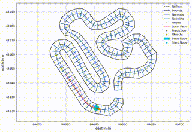
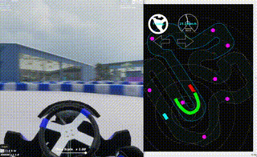

# AIチャレンジ2024環境でOSSをサブモジュールとして組み込む

## はじめに

本記事では、AIチャレンジ2024の環境でOSS（オープンソースソフトウェア）をサブモジュールとして使用する方法を紹介します。OSSを取り込む方法やサブモジュール化の手順を知りたい方に向けて、実際の作業内容を一から解説します。

## 概要

今回、以下のリポジトリで公開されている障害物回避用のローカルプランナーを組み込んだROS2パッケージを作成しました。

- [GraphBasedLocalTrajectoryPlanner](https://github.com/TUMFTM/GraphBasedLocalTrajectoryPlanner): 自動運転車両向けのグラフベースのローカルプランナー

最終的にOSSを組み込んだソースコードは、こちらのリポジトリで確認できます:

- [aichallenge2024_public](https://github.com/akodama428/aichallenge2024_public)
  - ブランチ：`apply_local_planner`

ちなみに、上記リポジトリは、GraphBasedLocalTrajectoryPlannerをサブモジュールとして組み込んでいるので、以下の手順でサブモジュールを更新する必要があります。
```bash
git clone https://github.com/akodama428/aichallenge2024_public.git
git checkout apply_local_planner
git submodule init
git submodule update
```


## 実施内容

### 1. AIチャレンジ2024のリポジトリをクローン

まずは、AIチャレンジ2024のリポジトリをクローンします。

```bash
git clone https://github.com/AutomotiveAIChallenge/aichallenge-2024.git
```

### 2. 新規のROS2パッケージを作成

次に、OSSとAutowareを連結するROS2パッケージとして[local_planner_custom](https://github.com/akodama428/aichallenge2024_public/blob/8cd2861999226645ce938693b52bf67e13221639/aichallenge/workspace/src/aichallenge_submit/local_planner_custom)を作成しました。
ROS2パッケージの作成方法は、[こちらの記事](https://blog.jbs.co.jp/entry/2024/08/28/143026)等が参考になりそうです。
ポイントとしては、[setup.py](https://github.com/akodama428/aichallenge2024_public/blob/cb9aaa33db780e7c05797b72d5d9300f2d5216d2/aichallenge/workspace/src/aichallenge_submit/local_planner_custom/setup.py)にて
submodulesの設定をする必要があります。

### 3. OSSをサブモジュールとして追加する

使用したいOSSを以下のように、パッケージ内にサブモジュールとして追加します。今回の例では、以下のコマンドで指定フォルダに追加します。

```bash
git submodule add https://github.com/akodama428/AIchallenge_Local_Planner.git aichallenge/workspace/src/aichallenge_submit/local_planner_custom/local_planner_custom/GraphBasedLocalTrajectoryPlanner
```

次に、OSSに必要なライブラリをインストールします。
AIチャレンジのコンテナ内でのライブラリインストールには、若干試行錯誤が必要だったので[setup.bash](https://github.com/akodama428/aichallenge2024_public/blob/cb9aaa33db780e7c05797b72d5d9300f2d5216d2/aichallenge/setup.bash)を作りました。
上記のシェルスクリプトを/aichallengeフォルダ直下において、コンテナ内で以下のコマンドを実行すれば、必要なライブラリがインストールされます。
```bash
cd /aichallenge
bash setup.bash
```

### 4. グローバル最適化トラジェクトリの設定

今回のローカルプランナは、与えられたグローバルパスに対して、障害物等を回避しながら自車前方のパスを生成するプランナなので、元となるグローバルパスを与えてあげる必要があります。
[Roborovsky Noteの記事](https://roborovsky-racers.github.io/RoborovskyNote/AutomotiveAIChallenge/2024/global_trajectory_optimization.html)を参考にさせてもらって、グローバル最適化パスを生成します。
ただし、ローカルプランナにはコース端情報も必要のため、記事の中で出てくるmain_globaltraj.pyの150行目あたりの以下の行のコメントアウトを外した上でmain_globaltraj.pyを実行します。
```bash
file_paths["traj_ltpl_export"] = os.path.join(file_paths["module"], "outputs", "traj_ltpl_cl.csv")
```

上記で生成されたtraj_ltpl_cl.csvをtraj_ltpl_cl_aichallenge.csvにリネームし、
GlobalBasedLocalTrajectoryPlanner内の[inputs/traj_ltpl_cl](https://github.com/akodama428/AIchallenge_Local_Planner/blob/e0fa30600d88bec46ee70df718cb318b4bbe5c9f/inputs/traj_ltpl_cl)フォルダに保存します。

### 5. パラメータの設定

車両諸元等、パラメータファイルを今回のシミュレーション環境に合わせて少し修正する必要があります。
あまりチューニングできてないですが、以下は、そこそこ走行可能なパラメータ設定になっています。
[パラメータファイル](https://github.com/akodama428/AIchallenge_Local_Planner/blob/e0fa30600d88bec46ee70df718cb318b4bbe5c9f/params)

### 6. `local_planner_custom`ノードの作成

GlobalBasedLocalTrajectoryPlannerのサンプルコード[main_std_example.py](https://github.com/akodama428/AIchallenge_Local_Planner/blob/e0fa30600d88bec46ee70df718cb318b4bbe5c9f/main_std_example.py)を参考にROS2ノードを作成します。
まずは、サンプルコードで動作を確認してみます。前章の通りに、グローバルパスやパラメータを正しく設定されていれば、以下のような簡易シミュレーションが実行されます。




グラフベースの回避パスが生成され、障害物回避パスも作られていそうです。
使い方が分かったので、先ほど作ったROS2ノード（local_planner_custom）に組み込みます。
実装の詳細は、[local_planner_custom.py](https://github.com/akodama428/aichallenge2024_public/blob/8cd2861999226645ce938693b52bf67e13221639/aichallenge/workspace/src/aichallenge_submit/local_planner_custom/local_planner_custom/local_planner_custom_node.py)を見ていただきたいですが、基本的には、サンプルコードの入出力をAutowareのIFに置き換えているだけです。

### 7. ローンチファイルの修正

最後に、ローンチファイル[reference.launch.xml](https://github.com/akodama428/aichallenge2024_public/blob/8cd2861999226645ce938693b52bf67e13221639/aichallenge/workspace/src/aichallenge_submit/aichallenge_submit_launch/launch/reference.launch.xml)を修正して適用します。`path_to_trajectory`パッケージを自作の`local_planner_custom`パッケージに置き換え、実行環境を整えます。

### 8. シミュレーション実行

シミュレーション実行結果です。パラメータ調整が十分でないためか、完全には障害物をよけきれていないですが、ローカルパスプランナとしては正しく動作してそうです。



---

この記事では、AIチャレンジ2024環境でOSSをサブモジュールとして利用する手順を紹介しました。今回の大会のように事前に障害物の位置が与えられている場合は、今回紹介したローカルパスプランナを用いずにMPCの境界制約だけでも十分回避可能かと思いますが、複数車両との競走などでは有効なのかもしれません。
OSSをサブモジュールとして組み込むことで、自分で一から機能開発するより効率的にやりたいことを実現できるので、ぜひ挑戦してみてください。
