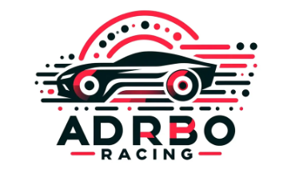

# 自己紹介

## BackGround
私たちは某自動車の同じ部署に所属する3人組のチームです。共に2023年冬の自動運転シミュレーション大会に出場していたことがきっかけでチームを結成しました。メンバーは車両運動、自律移動ロボット、小型フォーミュラカー製作、自動運転技術開発など、様々な専門知識と経験を持っており、それぞれの強みを生かし開発に取り組んでいます。前回のレーシングシミュレーション大会ではその強みを活かして、最優秀賞を獲得することができました

## Strategy
私たちの目指すのは、「人が運転するかのような自動運転」を実現することです。具体的には、熟練ドライバーが選ぶような走行経路を自動で生成できるプランナーの開発に力を入れています。このために、熟練ドライバーの運転データを収集し、そのデータを基に機械学習技術を用いてその運転を模倣するソフトを開発していました。（後日記事公開予定）
一方、2024年大会では、障害物が追加になり、人が運転するより自動運転の方がはるかに上手に運転できるため、上記の戦略を変更し、MPCを用いた自動運転システムを構築中です。

## 記事一覧

- [AIチャレンジ2024環境でOSSをサブモジュールとして組み込む](./docs/apply_local_planner/article20240918.md)